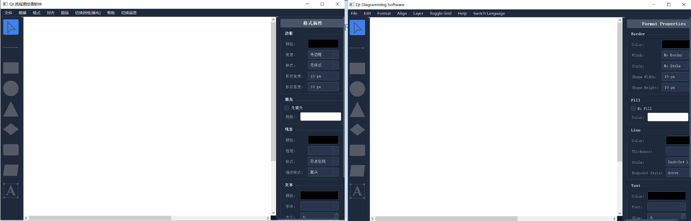
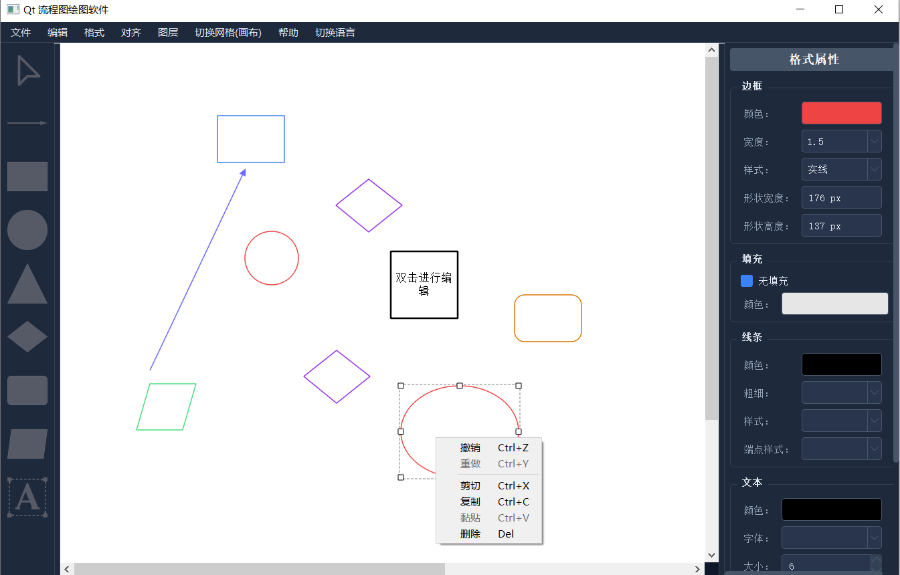
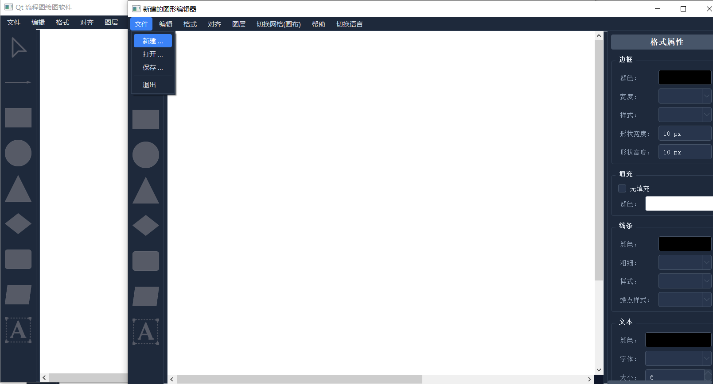
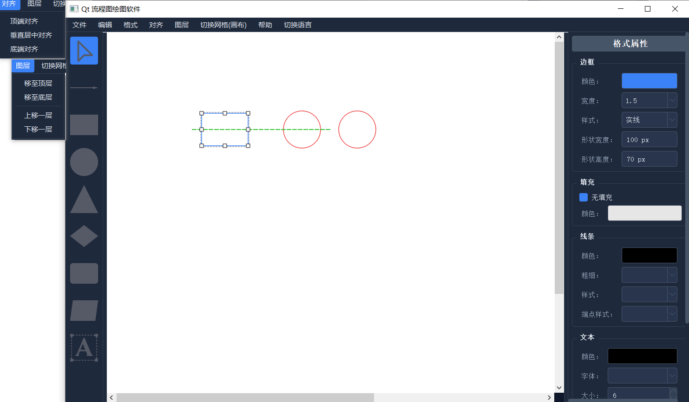

# 使用教程

cpp代码的头文件位于Header Files，源文件位于Source Files。如果想要自己编译，请切记我们这里使用的是QT5进行编程，否则可能会编译失败

在这里我们已经编译出了可执行文件，可以直接使用，点击目录下的MyDrawEditor.exe即可。

## 效果简介（这里仅仅做部分功能的效果展示，更多具体功能请参照:功能说明.md）

1.界面是深色主题，并且支持中/英文切换

2.支持基本图形的绘制，移动以及图形、颜色、线条大小，字体的相关属性改变，并且支持粘贴复制，撤销重做等，可以使用快捷键完成

2.支持新建，导入，保存等功能

3.支持图层的移动，和多图形的对齐，并且支持对齐提示

