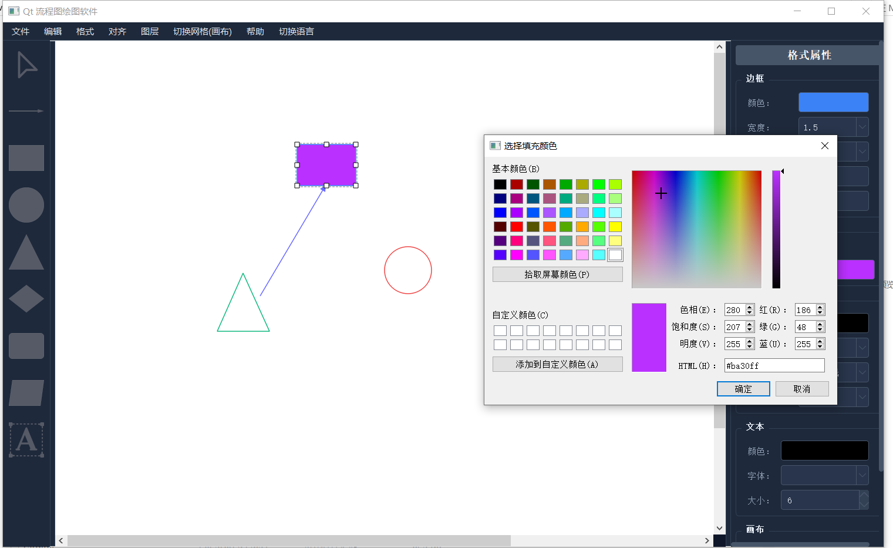

# MyDrawEditor功能说明

   该项目主要使用qt开发UI，该软件支持多种图形、连接线、文本编辑，以及撤销/重做、吸附、对齐和图层管理等高级功能。图表可以保存为 JSON 格式，并可导出为图像以及svg格式文件。文件中的MyDrawEditor.exe是我开发流程图编辑软件的可执行文件

**1. 核心组件**

- **主编辑器 (DiagramEditor):**
  
  - 协调所有组件：菜单栏、工具面板、绘图区和格式面板。
  
  - 管理撤销/重做栈。
  
  - 处理整体应用程序逻辑，如打开/保存文件和创建新窗口。

- **绘图区 (DrawingArea):**
  
  - 用户创建和交互图表元素的中心画布。
  
  - 支持缩放 (Ctrl+鼠标滚轮) 和平移 (通过滚动条)。
  
  - 画布尺寸可调节，并且当元素被移动或绘制到边缘附近时可以自动扩展。
  
  - 可以切换为网格画布。

- **工具面板 (ToolPanel):**
  
  - 位于左侧，提供快速访问以下工具：
    
    - 选择工具（鼠标光标）。
    
    - 图形绘制工具 (矩形、圆形、三角形、菱形、圆角矩形、平行四边形、文本框)。
    
    - 连接线工具。

- **格式面板 (FormatPanel):**
  
  - 位于右侧，动态显示以下对象的属性：
    
    - 选中的图形：边框颜色、边框宽度、边框样式、填充颜色、启用/禁用填充、宽度、高度。对于文本框：字体、文本颜色。
    
    - 选中的连接线：线条颜色、线条宽度、线条样式、启用/禁用箭头。
    
    - 画布：宽度、高度、缩放比例。
  
  - 允许用户直接修改这些属性。

- **菜单栏 (MenuBar):**
  
  - 提供对大多数应用程序功能的访问，分类到不同菜单中：
    
    - **文件:** 新建窗口、打开、保存、导出 (隐式包含在保存功能中)。
    
    - **编辑:** 撤销、重做、剪切、复制、粘贴、删除。
    
    - **视图:** 切换网格。
    
    - **格式:** 直接访问格式面板中可用的大多数样式选项。
    
    - **对齐:** 顶端对齐、垂直居中、底端对齐
    
    - **图层**：移至顶层、移至底层、上移一层、下移一层
    
    - **语言**: 可切换至英文/中文

**2. 主要功能**

**2.1. 画布与视图管理**

- **画布缩放:** 可以使用 Ctrl + 鼠标滚轮对绘图区进行放大/缩小。

- **可调节画布尺寸:** 可以通过格式面板设置画布的宽度和高度。

- **画布自动扩展:** 如果元素被绘制或移动到画布当前边界附近或超出边界，画布会自动增长，并平移现有内容以保持相对位置。

- **网格:** 可以选择切换一个可选的视觉网格，以辅助绘制。

- **平移:** 通过标准滚动条功能创建大于当前窗口的画布。

**2.2. 图形创建与操作**

- **图形类型:**
  
  - 矩形
  
  - 圆形
  
  - 三角形
  
  - 菱形
  
  - 圆角矩形 
  
  - 平行四边形 
  
  - 文本框

- **创建方法:**
  
  - 从 工具面板 选择一个图形工具，然后在 绘图区 上拖动。
  
  - 从 工具面板 拖动一个图形图标并将其放置到 绘图区 上。

- **移动:** 选中的图形可以在画布上拖动和移动。

- **调整大小:**
  
  - 选中的图形 (或一组选定项) 显示8个调整大小的控制手柄 (角点和中点)。
  
  - 拖动这些手柄可以调整选区的大小。
  
  - 会强制执行最小图形尺寸。

- **吸附与对齐参考线:**
  
  - 临时的视觉对齐参考线 (绿色虚线) 会出现以指示吸附。
  
  - 吸附阈值有助于控制灵敏度；较大的明确移动可以覆盖吸附。

- **删除:** 可以使用 Delete 键、编辑菜单或右键菜单删除选中的图形。

**2.3. 连接线（注：连接线的创建不支持直接从工具面板拖动）**

- **创建:**
  
  - 选择连接线工具。
  
  - **点击并拖动:** 在画布空白区域点击并拖动到另一点 (可以是空白或图形的连接点)。
  
  - **点击图形连接点, 拖动到目标点:** 点击图形的连接点并拖动到另一点 (空白或另一个图形的连接点)。

- **连接机制:**
  
  - 线条可以是完全自由的 (两端均未连接图形)。
  
  - 线条可以是部分连接的 (一端连接到图形的连接点，另一端自由)。
  
  - 线条可以是完全连接的 (两端均连接到图形的连接点)。
  
  - 连接端会随图形自动移动。

- **视觉反馈:**
  
  - 在创建或拉伸线条时，如果鼠标悬停在图形连接点上，该连接点会高亮显示。
  
  - 创建过程中会绘制临时线条，并且当连接线靠近图形时，图形会显示显示连接点。

- **操作:**
  
  - **拉伸自由端:** 选中的具有自由端的线条会显示控制手柄，可以拖动这些手柄来重新定位自由端。自由端可以吸附到图形的连接点。
  
  - **分离连接端:** 点击并拖动选中线条的已连接端点，会将其分离，使其可以自由移动或重新连接到其他位置。

- **样式:** 可以配置颜色、宽度、样式 (实线、虚线、点线等)，以及在端点可选的箭头。

**2.4. 选择**

- **单选:** 点击一个图形或线条。

- **多选:**
  
  - **Ctrl + 点击:** 从当前选区中添加或移除单个项目。
  
  - **框选:** 在画布空白区域点击并拖动以绘制选择框。所有与选择框相交的项目都将被选中 (如果按住 Ctrl 键，则添加到选区)。

- **清除选择:**
  
  - 在画布空白区域点击 (不按 Ctrl 键)。
  
  - 按 Esc 键。

- **视觉反馈:** 选中的项目通常会高亮显示，并且整个选区周围会出现带有调整大小控制手柄的边界框。

**3.5. 样式与格式化**

- **图形:**
  
  - **边框:** 颜色、宽度 (包括 "无边框")、样式 (实线、虚线、点线等)。
  
  - **填充:** 颜色、启用/禁用填充。
  
  - **尺寸:** 宽度和高度 (针对单个选中的图形)。

- **连接线:**
  
  - **线条:** 颜色、宽度、样式 (实线、虚线、点线等)。
  
  - **箭头:** 切换在线条端点显示箭头。

- **文本 (文本框内):**
  
  - **字体:** 字体、大小。
  
  - **文本颜色。**

**2.6. 文本编辑**

- **文本框元素:** 用于添加文本的专用图形。

- **原地编辑:** 双击一个 文本框 进入编辑模式。一个 QLineEdit 编辑器会覆盖在 文本框 上方用于文本输入。

- **格式化:** 如样式部分所述，可以应用字体和文本颜色。

- **完成编辑:**
  
  - 按 Enter 键。
  
  - 在 QLineEdit 编辑器外部单击。
  
  - 如果文本内容已更改，则该修改将被记录以供撤销/重做。

**2.7. 排列**

- **对齐 (针对2个或更多选中的图形):**
  
  - 顶端对齐
  
  - 垂直居中对齐
  
  - 底端对齐
  
  - (水平对齐选项未明确列出，但可能计划中)

- **图层管理 :**
  
  - 移至顶层 (置于最前)
  
  - 移至底层 (置于最后)
  
  - 上移一层
  
  - 下移一层

**2.8. 文件操作**

- **新建窗口:** 打开一个新的、独立的图表编辑器实例。

- **打开:** 从 JSON (.json) 文件加载图表。清除当前画布并加载图形、线条和画布尺寸。

- **保存:** 将当前图表保存到 JSON (.json) 文件。
  
  - 包括图形、线条 (及其连接关系和ID) 以及画布尺寸。
  
  - 保存JSON后，会提示用户是否同时保存图像或者svg图形。

- **图像导出 (JSON保存后):**
  
  - 可选择将画布另存为 SVG (可缩放矢量图形) 或 PNG (便携式网络图形) 图像。
  
  - 默认图像文件名基于JSON文件名。

**2.9. 编辑操作**

- **撤销/重做:** 对大多数操作提供全面的撤销/重做支持：
  
  - 添加/移除图形和线条。
  
  - 移动图形和线条。
  
  - 调整图形大小。
  
  - 更改属性 (颜色、宽度、样式、文本、字体等)。
  
  - 对齐操作。

- **剪切、复制、粘贴:**
  
  - 针对选中的图形和线条的标准剪贴板操作。
  
  - 粘贴的项目会从其原始位置略微偏移，并分配新的唯一ID。
  
  - 仅当线条连接的图形 (如果有) 也属于选区的一部分时，线条才会被复制/粘贴。

- **删除:** 从画布中移除选定的项目 (可撤销)。

- **右键菜单:** 在画布上右键单击可访问常用操作：撤销、重做、剪切、复制、粘贴、删除。

**2.10. 用户界面**

- **主题:** 现代化的深色主题界面元素 (工具栏、滚动条、菜单)。

- **分割器:** 工具面板、绘图区和格式面板之间有可调整大小的分割器。

- **国际化:** 界面文本已准备好进行翻译 (例如，使用 tr() 函数)。窗口标题会随语言更改。

- **光标反馈:** 鼠标光标会动态变化以指示当前工具、悬停状态 (例如，在调整大小手柄、连接点上) 或操作 (例如，移动、绘图)。

**注： 本人开发的软件基本上为所有的操作都实现了撤销/重做的功能**

## **3.结果展示**

